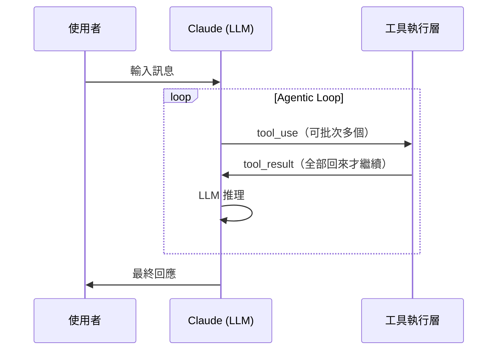
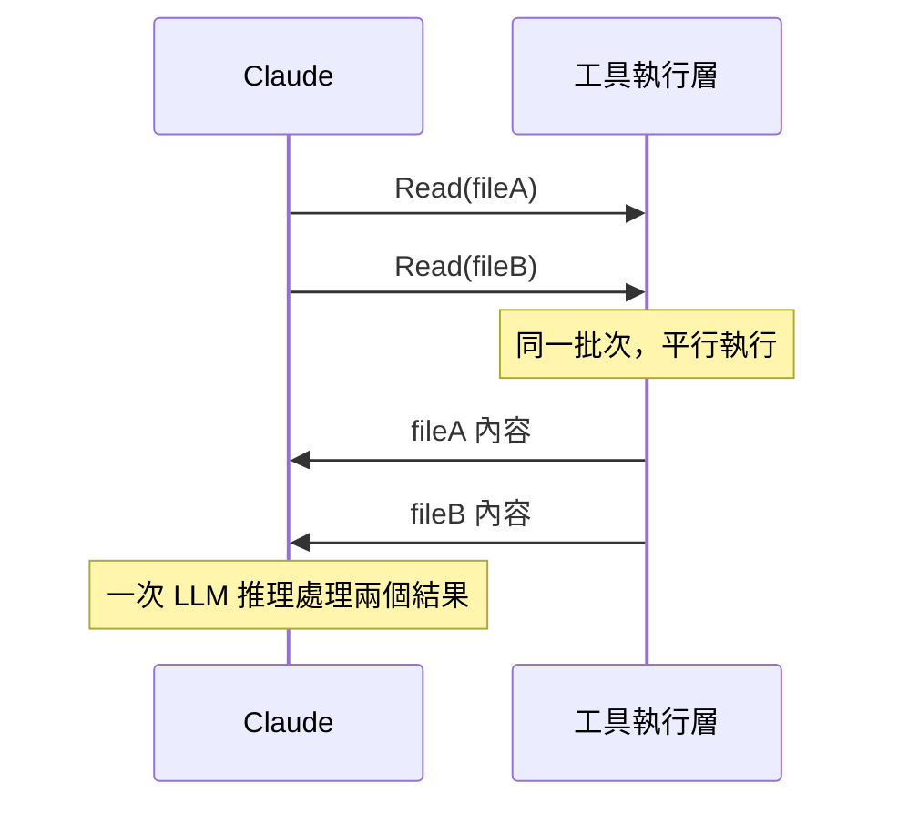
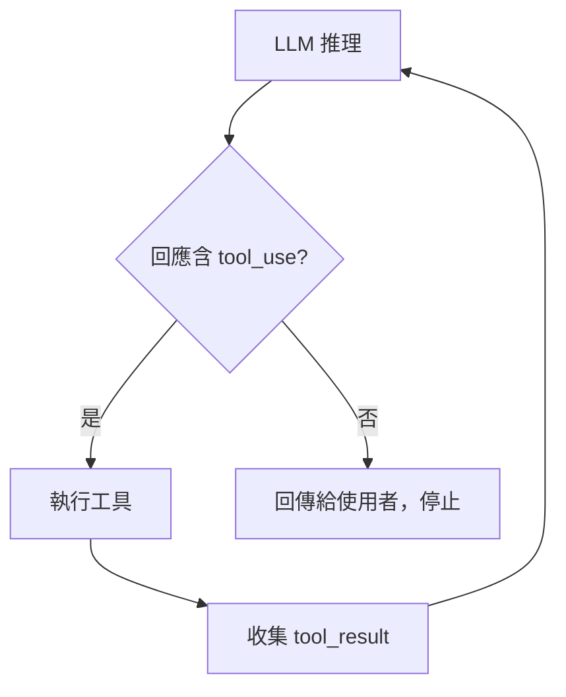

# Claude Code 工具系統

## Agentic Loop

Claude Code 的工具執行架構基於 Anthropic API 標準 agentic loop：



### 單次推理的回應結構

一次 LLM 推理可在同一個 `content` 陣列中同時包含 `text` 和 `tool_use`，順序固定：

```json
{
  "content": [
    { "type": "thinking", "signature": "..." },
    { "type": "text", "text": "說明文字..." },
    { "type": "tool_use", "name": "Edit", "input": {...} },
    { "type": "tool_use", "name": "Edit", "input": {...} }
  ]
}
```

所以並非「text **或** tool_use」，而是**一次推理可同時產生 text + 多個 tool_use**。

### 批次 tool call（一次推理可執行多個工具）



### 平行 vs 串聯：`isConcurrencySafe` 旗標

每個工具物件都有 `isConcurrencySafe()` 方法，framework 執行迴圈依此決定能否平行：

```javascript
// binary 2.1.77 原文
for (H of this.tools) {
  if (H.status !== "queued") continue;
  if (this.canExecuteTool(H.isConcurrencySafe))
    await this.executeTool(H);       // 可平行就繼續跑
  else if (!H.isConcurrencySafe)
    break;                           // 不安全則 break，該工具單獨跑完再繼續
}
```

| `isConcurrencySafe` | 工具 | 說明 |
|---------------------|------|------|
| `true` | Read、Glob、Grep（唯讀類） | 可與其他工具平行執行 |
| `false` | Write、NotebookEdit、EnterWorktree、ExitWorktree、CronCreate、CronDelete、TodoWrite、MCP | 遇到即 break，強制單獨執行 |

**實測驗證**：同一 response 發出兩個 `sleep 2` Bash 命令，兩者幾乎同時開始（差 197ms）、同時結束，總耗時 ~2 秒而非 ~4 秒，確認平行執行。來源：session 計時實測 2026-03-17。

**推論**：Edit 尚未直接確認，但屬寫入工具，預期也是 `isConcurrencySafe: false`。

### API 層級的串聯控制

`disable_parallel_tool_use: true`：Anthropic API 參數，設定後強制 Claude 每次 response 只發一個 tool_use（API caller 使用，非 Claude Code 終端用戶設定）。

來源：binary `2.1.77` offset 131,932,552。

### Loop 終止條件

LLM 推理產生的回應**不含 `tool_use`** 時，loop 結束，控制權回到使用者：



#### 原始碼驗證（來源：外流原始碼 2.1.88 `query.ts`）

Loop 的實際結構是 **`while (true)`**（`query.ts:307`），**非遞迴**。終止信號是 `needsFollowUp` flag：

```typescript
// query.ts:554-558
// Note: stop_reason === 'tool_use' is unreliable — it's not always set correctly.
// Set during streaming whenever a tool_use block arrives — the sole loop-exit signal.
const toolUseBlocks: ToolUseBlock[] = []
let needsFollowUp = false
```

```typescript
// query.ts:831-834
if (msgToolUseBlocks.length > 0) {
  toolUseBlocks.push(...msgToolUseBlocks)
  needsFollowUp = true   // ← 有 tool_use → 繼續
}

// query.ts:1062
if (!needsFollowUp) {
  // ... stop hook 處理
  return { reason: 'completed' }  // ← 正常終止
}
```

**重要**：`stop_reason === 'tool_use'` **不可靠**（原始碼明確注解）。實際判斷依據是 streaming 過程中是否收到 tool_use block。

#### Loop 的終止原因列表（`reason` 欄位）

| reason | 說明 |
|--------|------|
| `completed` | 正常完成（無 tool_use，stop hook 通過）|
| `max_turns` | 達到 `maxTurns` 上限（`query.ts:1705`）|
| `aborted_streaming` | 使用者 Ctrl+C（streaming 途中中斷）|
| `aborted_tools` | 使用者 Ctrl+C（工具執行途中中斷）|
| `hook_stopped` | Stop hook 阻止繼續 |
| `stop_hook_prevented` | Stop hook 回傳 prevent_continuation |
| `blocking_limit` | Context 達硬性 token 上限 |
| `model_error` | API 呼叫錯誤 |
| `prompt_too_long` | Prompt 超長（無法自動 compact 時）|

#### Tools 的 refresh 機制（與 ToolSearch 相關）

每次 loop iteration 結束、準備下一輪前，有一個 `refreshTools()` 呼叫：

```typescript
// query.ts:1660-1670
if (updatedToolUseContext.options.refreshTools) {
  const refreshedTools = updatedToolUseContext.options.refreshTools()
  if (refreshedTools !== updatedToolUseContext.options.tools) {
    updatedToolUseContext = {
      ...updatedToolUseContext,
      options: { ...updatedToolUseContext.options, tools: refreshedTools },
    }
  }
}
```

這是 ToolSearch 讓新工具在下一輪可用的機制入口（待 T03 確認細節）。

### 例外情況

| 情況 | 說明 |
|------|------|
| **批次 tool call** | 多個 tool_use 同批發出 → 全部結果一起回來 → 一次推理 |
| **`disable-model-invocation: true`** | Skill 可設定跳過 LLM 推理，直接執行 |
| **背景 Bash（`run_in_background`）** | 不阻塞，inference 繼續；結果以 `<task-notification>` 非同步通知 |
| **Subagent** | 有自己獨立的 agentic loop，不佔主 agent 的推理次數 |

來源：`6370316b...jsonl`（行為觀察）；外流原始碼 2.1.88 `query.ts` `while(true)` loop（原始碼驗證）。

---

## 工具分類

工具分三類：

| 類型 | 說明 | 數量 |
|------|------|------|
| **Pre-loaded（系統預載）** | schema 已在 context，可直接呼叫 | 9 個 |
| **Deferred（延遲載入）** | schema 未載入，需先 ToolSearch；系統以 `<available-deferred-tools>` 標記 | 16 個 |
| **MCP** | 由外部 MCP server 提供（`mcp__{server}__{tool}`）；server 連線時預載，未連線時不存在 | 視設定 |

延遲載入的好處：節省 token（工具 schema 很長）；代價：多一次 ToolSearch round trip。

---

## 完整工具清單

**權限說明：**
- **自動允許**：預設直接執行，不詢問
- ⚠️ **預設詢問**：可透過 `permissions.allow` 設定關閉（詳見 [permissions.md](permissions.md)）

| 工具 | 類型 | 權限 | 作用 |
|------|------|------|------|
| **Read** | 預載 | 自動允許 | 讀取本地檔案內容；支援圖片（base64）、`.ipynb`（解析 cells）、PDF（`pages` 參數，最多 20 頁/次）；25,000 token 上限（超過回 error string，不截斷）；支援 `offset`/`limit` 分段讀取 |
| **Glob** | 預載 | 自動允許 | 用 glob pattern 搜尋檔案路徑 |
| **Grep** | 預載 | 自動允許 | 用 regex 搜尋檔案內容（ripgrep） |
| **ToolSearch** | 預載 | 自動允許 | 載入 deferred 工具（見下方） |
| **TaskGet** | Deferred | 自動允許 | 取得任務詳情 |
| **TaskList** | Deferred | 自動允許 | 列出所有使用者任務 |
| **TaskOutput** | Deferred | 自動允許 | 讀取背景 Bash 任務輸出 |
| **CronList** | Deferred | 自動允許 | 列出所有排程 |
| **Edit** | 預載 | ⚠️ 可設定 | 精確字串替換（old_string → new_string）；old_string 必須唯一，否則報錯；支援 `replace_all`；只傳 diff，token 消耗少；設定：`Edit` |
| **Write** | 預載 | ⚠️ 可設定 | 覆寫整個檔案內容；適合新建檔或完整改寫；token 消耗多；設定：`Write` |
| **Bash** | 預載 | ⚠️ 可設定 | 執行 shell 命令；支援 `run_in_background`（完成後以 `<task-notification>` 通知）；設定：`Bash(command:*)` |
| **Agent** | 預載 | ⚠️ 可設定 | 啟動子 agent（見下方）；設定：`Agent` |
| **Skill** | 預載 | ⚠️ 可設定 | 執行 skill（見下方）；設定：`Skill(skill-name)` |
| **AskUserQuestion** | Deferred | ⚠️ 可設定 | 主動向使用者提問；設定：`AskUserQuestion` |
| **WebFetch** | Deferred | ⚠️ 可設定 | 抓取 URL 內容；設定：`WebFetch(domain:example.com)` |
| **WebSearch** | Deferred | ⚠️ 可設定 | 搜尋網路；設定：`WebSearch` |
| **NotebookEdit** | Deferred | ⚠️ 可設定 | 編輯 Jupyter notebook（`.ipynb` 必須用此工具，Edit 會報錯）；設定：`NotebookEdit` |
| **EnterPlanMode** | Deferred | ⚠️ 可設定 | 進入 Plan 模式；計畫存至 `~/.claude/plans/{slug}.md` |
| **ExitPlanMode** | Deferred | ⚠️ 可設定 | 離開 Plan 模式，提交計畫給使用者審核 |
| **EnterWorktree** | Deferred | ⚠️ 可設定 | 在 `.claude/worktrees/{name}` 建立 git worktree 隔離環境 |
| **TaskCreate** | Deferred | ⚠️ 可設定 | 建立任務（ID 為數字，如 `1`）；設定：`TaskCreate` |
| **TaskUpdate** | Deferred | ⚠️ 可設定 | 更新任務狀態；設定：`TaskUpdate` |
| **TaskStop** | Deferred | ⚠️ 可設定 | 停止**背景 Bash 任務**（ID 為 hash，如 `bz6rlnhqb`）；無法停止 TaskCreate 任務；設定：`TaskStop` |
| **CronCreate** | Deferred | ⚠️ 可設定 | 建立定時排程（session-only，Claude 退出後消失）；設定：`CronCreate` |
| **CronDelete** | Deferred | ⚠️ 可設定 | 刪除排程；設定：`CronDelete` |
| **mcp__ide__getDiagnostics** | MCP | ⚠️ 可設定 | 取得 IDE 診斷資訊（lint/type 錯誤）；設定：`mcp__ide__getDiagnostics` |
| **mcp__ide__executeCode** | MCP | ⚠️ 可設定 | 在 IDE 執行程式碼；設定：`mcp__ide__executeCode` |

來源：`b360f366...jsonl`（完整工具調用測試）

---

## 工具分類（依功能）

除了 Pre-loaded/Deferred/MCP 分類，工具也可依**操作性質**分類：

| 類型 | 工具 | 說明 |
|------|------|------|
| **唯讀** | Read, Glob, Grep, WebFetch, WebSearch, TaskGet, TaskList, TaskOutput, CronList, mcp__ide__getDiagnostics | 不修改任何狀態 |
| **寫入** | Edit, Write, NotebookEdit | 修改本地檔案 |
| **執行** | Bash | 執行任意 shell 命令 |
| **規劃/隔離** | EnterPlanMode, ExitPlanMode, EnterWorktree, ExitWorktree | 切換操作模式或環境 |
| **任務管理** | TaskCreate, TaskUpdate, TaskStop, CronCreate, CronDelete | 管理背景任務與排程 |
| **互動/meta** | AskUserQuestion, ToolSearch, Skill, Agent | 和使用者/其他工具互動 |
| **IDE** | mcp__ide__getDiagnostics, mcp__ide__executeCode | VS Code/JetBrains 整合 |

來源：binary `2.1.72`，`filePatternTools: ["Read","Write","Edit","Glob","NotebookRead","NotebookEdit"]`（使用不同的匹配邏輯）

---

## 為何有 Read/Write 而不直接用 Bash

Read/Write 不是 Bash 的語法糖，兩者在架構上有本質差異：

| 面向 | Read/Write/Edit | Bash |
|------|-----------------|------|
| **權限粒度** | 預設 Read 自動允許；Write/Edit 分開設定 | 全部走 prefix/exact/wildcard 規則 |
| **匹配邏輯** | `filePatternTools`（路徑型規則） | `bashPrefixTools`（命令型規則） |
| **Token 限制** | Read 上限 25,000 tokens（超過回 error string） | 無強制限制 |
| **Diff 計算** | Write/Edit 自動計算 structuredPatch + gitDiff 顯示給使用者 | 無 |
| **寫入範圍** | 限制在工作目錄 + 子目錄（框架層強制） | 不限制 |
| **特殊格式** | 圖片（base64 視覺理解）、`.ipynb`（解析 cells+outputs）、PDF（頁數分段） | 只有 raw bytes/text |
| **預設權限** | Read 自動允許；Write 需確認 | 全部需確認 |

Read/Write 讓 Claude Code 有「唯讀瀏覽」vs「寫入」的清晰權限界線，而不必所有檔案操作都要走 Bash confirm。

### Read vs Grep vs Bash 的選擇邏輯

| 情境 | Read | Grep | Bash |
|------|:----:|:----:|:----:|
| 讀取一般文字/程式檔 | ✓ | | |
| 需要特定行範圍（offset/limit） | ✓ | | |
| 讀圖片、PDF、ipynb（專用解析） | ✓ | | |
| 搜尋哪些檔案含某字串 | | ✓ | |
| 在已知檔案裡找特定內容位置 | ✓（配合 offset） | ✓ | |
| 讀目錄內容 | | | ✓（ls） |
| 讀 binary 檔案 | | | ✓（strings、xxd） |
| 需要 filter／管線處理 | | | ✓ |

**根本原因**：Read 和 Grep 預設自動允許，Bash 需要確認。能用專用工具就用，避免打斷使用者。系統 prompt 也明確指示「Use Read instead of cat/head/tail」。

### Write vs Edit

| | Write | Edit |
|--|-------|------|
| **操作方式** | 覆寫整個檔案 | 精確字串替換（old_string → new_string） |
| **適用情境** | 新建檔、完整改寫 | 修改現有檔案的一部分 |
| **唯一性限制** | 無 | old_string 必須在檔案中唯一，否則報錯 |
| **replace_all** | 無 | 有，可替換所有匹配 |
| **token 消耗** | 傳送整個檔案內容（多） | 只傳 diff（少） |
| **diff 顯示** | 有 structuredPatch + gitDiff | 有 |

Edit 是日常主力；Write 用於「整個檔案都要換」或「新建檔案」的情境。

來源：binary `FileReadTool`、`FileWriteTool`；官方安全文件

### 為何某些 Bash 能做的事要獨立成 tool

設計原則：**能預測行為邊界的操作，做成專用 tool；需要靈活組合的，留給 Bash。**

| Bash 可做 | 獨立 tool | 獨立的理由 |
|-----------|-----------|-----------|
| `cat file` | Read | 安全、token 限制、特殊格式解析 |
| `rg pattern` | Grep | 安全、結構化輸出、不走 shell |
| `find . -name "*.js"` | Glob | 安全、結果結構化 |
| `echo > file` | Write | 安全、diff 計算、寫入範圍限制 |

**Bash 的風險在命令字串本身**，所以需要 prefix/exact/wildcard 規則做細粒度控制；專用 tool 的參數由 framework 固定組裝，沒有 shell injection 風險，只需要工具層級的允許/拒絕。

**Grep vs Bash 執行機制的差異：**
- **Bash**：起完整 bash shell，命令字串透過 shell 解析（`&&`、pipe、環境變數展開都有效）
- **Grep**：直接 spawn ripgrep binary，不走 shell（所以走 `filePatternTools` 路徑，不受 bash prefix 規則管控）

---

## 工具與 LLM 的關係

大多數工具本身不呼叫 LLM，純粹執行操作：

| 工具 | 是否使用 LLM | 說明 |
|------|------------|------|
| Bash, Read, Write, Edit, Glob, Grep | ✗ | 純執行，無 LLM |
| WebFetch, WebSearch | ✗ | 網路請求，結果直接回傳給主 LLM |
| ToolSearch | ✗ | schema 查找，無 LLM |
| AskUserQuestion | ✗ | 向使用者請求輸入，無 LLM |
| **Agent** | ✓ | 啟動獨立 LLM（可能不同 model，如 Haiku） |
| **Skill** | 視設定 | 預設注入 context 後讓主 LLM 處理；`disable-model-invocation: true` 跳過 LLM |
| **`prompt` 型 Hooks** | ✓ | 用指定 model 評估（預設用輕量快速 model） |

來源：binary `disableModelInvocation`；`disable-model-invocation` frontmatter；Agent 實測（Haiku vs Sonnet）

---

## Skill 的執行機制

### Framework 對 Skill 做的處理（依序）

Claude Code framework 在把 skill 內容交給 LLM 之前，會做以下處理：

```
讀取 SKILL.md
    ↓
1. 變數替換：${CLAUDE_SKILL_DIR}、${CLAUDE_SESSION_ID}、$ARGUMENTS
    ↓
2. ! 前綴命令：執行 shell，輸出替換原行（LLM 看不到原始命令）
    ↓
3. allowed-tools：合併進 toolPermissionContext.alwaysAllowRules
    ↓
4. 依 frontmatter 決定執行路徑（見下方）
    ↓
回傳 tool_result: [{ type: "text", text: 處理後的內容 }]
```

### 觸發路徑

| 方式 | 觸發者 | tool_result 注入方式 |
|------|--------|---------------------|
| `/skill-name args` | 使用者輸入 | `isMeta: true` user message |
| `Skill("name", args)` | Claude 主動 | tool_result text block |

兩者 framework 處理邏輯相同，差在注入位置不同。

### 無參數時的行為

`$ARGUMENTS` 為空 → `!` 命令帶空字串執行 → script 炸錯 → `is_error: true` 的 tool_result 回給 LLM → LLM 再推理補救（如 Glob 找路徑）。framework 不攔截、不提示，由 LLM 自行處理。

來源：JSONL 實測（toolu_01J4WfTXM5...）

### Frontmatter 欄位對應的 framework 邏輯

| 欄位 | framework 行為 |
|------|---------------|
| `allowed-tools` | 合併進 `alwaysAllowRules`（軟性，僅自動允許，不限制其他工具） |
| `disable-model-invocation: true` | （1）skill 描述不注入 context（context 成本為零，只能手動 invoke）；（2）tool_result 回來後不觸發 LLM 推理，loop 停止 |
| `context: fork` | 建立獨立 fork context，不共享主 session 歷史 |
| `agent` | 路由到指定 subagent_type 執行 |
| `model` | 用指定 model 而非預設 |
| `hooks` | skill 層級的 hook 事件 |
| `user-invocable` | 控制是否出現在使用者可呼叫的 skill 清單 |
| `when_to_use` | 提供給 LLM 判斷何時主動呼叫的說明 |
| `argument-hint` | 純顯示用提示（使用者 UI + 告知 LLM 要傳什麼 args），無驗證 |

### `allowed-tools` 是軟性限制

```
skill 執行期間 alwaysAllowRules
= settings.json 原有規則
+ allowed-tools 裡的規則      ← 合併，不是替換
```

skill 跟主 LLM 共享同一 context，allowed-tools 只是「這些工具不用問」，不能阻止 LLM 呼叫其他工具（其他工具仍可用，但需確認）。與 Agent tools 的硬性限制（API 層，LLM 根本看不到其他工具 schema）本質不同。

### `!` 前綴命令

```markdown
!`python3 "${CLAUDE_SKILL_DIR}/scripts/parse.py" "$ARGUMENTS"`
```

- framework 在注入前執行，LLM 收到的是輸出結果，看不到原始命令
- 用於大量資料預處理（如壓縮 92KB JSONL 成摘要），避免 LLM 直接面對原始資料
- 執行失敗 → 錯誤訊息替換原行，作為 tool_result 內容回給 LLM

來源：binary `CLAUDE_SKILL_DIR`、`disable-model-invocation`、`alwaysAllowRules`；JSONL 實測

---

## Skill `allowed-tools` vs Agent 的工具權限

| | Skill `allowed-tools` | Agent `tools` 參數 |
|--|----------------------|-------------------|
| **執行環境** | 主 session（同 context） | 獨立 subagent（獨立 context） |
| **隔離程度** | 限制但共享主 session 狀態 | 完全隔離 |
| **設定位置** | SKILL.md frontmatter | Agent tool 呼叫參數 / `--agents` CLI flag |
| **繼承** | 若未設定，預設繼承主 session 所有工具 | 若未設定，預設繼承全部工具 |
| **作用** | skill 執行期間 Claude 只能用這些工具 | subagent 整個生命週期只有這些工具 |

**為何 Skill 需要 allowed-tools？**

Skill 在主 session 執行，主 Claude 有全部工具。若不限制，skill 執行中 Claude 可能用到 skill 設計者不預期的工具。`allowed-tools` 讓 skill 成為**有邊界的操作集**，例如 session-analyze 只允許 Bash + Read，確保它不會意外呼叫 Agent 或 Write。

來源：binary `allowed-tools`、`allowedTools` frontmatter 解析

---

## ToolSearch

**元工具（工具的工具）**，用於動態發現 deferred 工具。

### 查詢模式

| 模式 | 範例 | 說明 |
|------|------|------|
| 直接選取 | `select:Glob` | 知道工具名稱時直接選取 |
| 多工具選取 | `select:Read,Edit,Grep` | 一次選取多個 |
| 關鍵字搜尋 | `"list directory"` | 不確定工具名稱時搜尋 |

### 真實運作機制（來源：外流原始碼 2.1.88 `utils/toolSearch.ts`）

ToolSearch **不是** 把 schema 文字注入 tool_result，而是透過一套 **beta API 機制**運作：

```
tools[] 中的 deferred 工具標記 defer_loading: true
    ↓
Claude 呼叫 ToolSearch("select:ToolName")
    ↓
API 在 tool_result 中返回 tool_reference 區塊
    ↓
{ type: 'tool_reference', tool_name: 'ToolName' }
    ↓
API server-side 展開成完整 schema 讓 Claude 看到
    ↓
Claude 直接呼叫 ToolName(...)
```

**關鍵**：`tool_reference` 是 Anthropic beta API 功能，由伺服器端展開，不進入 JSONL 的標準欄位，所以我們的 session JSONL 中 ToolSearch tool_result 顯示為空——實際上有內容，只是 beta 格式解析器未覆蓋。

### tools[] 陣列始終穩定

deferred 工具「始終在 `tools[]` 中」，只是帶有 `defer_loading: true`：

```typescript
// tools[] 從 session 開始到結束結構不變
tools: [
  { name: 'Bash', ... },           // pre-loaded，完整 schema
  { name: 'Read', ... },           // pre-loaded，完整 schema
  { name: 'SomeMCPTool',           // deferred
    defer_loading: true, ... },
]
```

這就是為什麼 ToolSearch 前後 **KV cache 不 bust**（JSONL 驗證：`6370316b`，cache_read 單調遞增）：tools[] 結構穩定，prompt cache 不受影響。

### toolSchemaCache（來源：`utils/toolSchemaCache.ts`）

> "Tool schemas render at server position 2 (before system prompt), so any byte-level change busts the entire ~11K-token tool block AND everything downstream."

工具 schema 在 KV cache 中排在 **system prompt 之前（position 2）**。任何 schema 變動都會 bust 整個 tool block + 下游所有 messages 的 cache。因此 Claude Code 用 `toolSchemaCache` 把 schema 在 session 內 memoize，防止 GrowthBook gate flip 或 MCP 重連造成不必要的 cache bust。

### 有效範圍

- **同一 session**：`tool_reference` 已在 message history → 下一輪 API 呼叫時 server 知道已發現，可直接使用
- **跨 session**：history 清空，需重新 ToolSearch

### ToolSearchMode 三種模式（來源：`utils/toolSearch.ts:161`）

```ts
type ToolSearchMode = 'tst' | 'tst-auto' | 'standard'
```

| mode | 說明 |
|------|------|
| `'tst'` | 永遠 defer MCP 與 shouldDefer 工具（always on） |
| `'tst-auto'` | 只有工具 token 超過閾值才 defer（auto threshold） |
| `'standard'` | 全部 inline，不 defer，等同停用 ToolSearch |

**`ENABLE_TOOL_SEARCH` env var 對應邏輯**（`getToolSearchMode()`）：

| 值 | 模式 |
|----|------|
| 未設定（預設） | `tst`（永遠 defer） |
| `true` | `tst` |
| `false` | `standard` |
| `auto` | `tst-auto`（預設 10% 閾值） |
| `auto:N`（N=0） | `tst`（0% = 永遠啟用） |
| `auto:N`（N=1-99） | `tst-auto`（N% 閾值） |
| `auto:N`（N=100） | `standard`（100% = 永遠停用） |

**Auto-threshold 計算**：預設 context window 的 **10%**；可透過 GrowthBook 覆蓋（無需改 code）。Token 計算先呼叫 token counting API，失敗時退回 **chars ÷ 2.5** 估算。

### ToolSearch 停用條件（優先序由高到低）

| 條件 | 行為 | 來源 |
|------|------|------|
| `CLAUDE_CODE_DISABLE_EXPERIMENTAL_BETAS=true` | 強制 `standard`，不論其他設定 | `toolSearch.ts:181` |
| `ENABLE_TOOL_SEARCH=false` / `auto:100` | `standard` | `toolSearch.ts:196` |
| 非 first-party `ANTHROPIC_BASE_URL` 且未明確設定 `ENABLE_TOOL_SEARCH` | 停用（見下方）| `toolSearch.ts:299-311` |
| Haiku 模型（或 GrowthBook `tengu_tool_search_unsupported_models` 清單） | 不支援 `tool_reference` | `toolSearch.ts:204` |

**第三方 proxy 的特別邏輯**（重要）：

`tool_reference` 是 Anthropic beta 功能，許多第三方 API proxy（`ANTHROPIC_BASE_URL` 指向非官方端點）不支援，會回傳 400。因此，若：
- `ENABLE_TOOL_SEARCH` **未明確設定**（空字串或未設）
- 且 API provider 是 `'firstParty'`（即不是 Bedrock/Vertex）
- 但 `ANTHROPIC_BASE_URL` 不是 first-party Anthropic 主機

則 `isToolSearchEnabledOptimistic()` 返回 `false`，停用 ToolSearch。

**若你的 proxy 支援 tool_reference**（如 LiteLLM passthrough、Cloudflare AI Gateway）：設定 `ENABLE_TOOL_SEARCH=true` 或 `auto` 即可重新啟用，明確設定代表用戶聲明 proxy 支援。

**Haiku 不支援的機制**：透過 `getFeatureValue_CACHED_MAY_BE_STALE('tengu_tool_search_unsupported_models', null)` 從 GrowthBook 取得清單，預設為 `['haiku']`，可線上更新不需改 code。

---

## Skill 系統

### Skill 是什麼

放在 `.claude/skills/<name>/SKILL.md` 的 Markdown 指令檔，告訴 Claude 如何完成特定任務。

### Priority 順序

同名 skill 衝突時，依以下優先序解析（來源：官方文件 `skills`）：

```
Enterprise > Personal (~/.claude/skills/) > Project (.claude/skills/) > Plugin (plugin-name:skill-name)
```

Plugin skill 需加 namespace（`/plugin-name:skill-name`）避免衝突。

### 觸發方式

| 方式 | 觸發者 | 機制 |
|------|--------|------|
| `/skill-name` | 使用者輸入 | CLI 在框架層讀取 SKILL.md，展開為 `isMeta: true` 訊息注入 context；Claude 不需呼叫 Skill 工具 |
| `Skill` tool | Claude 主動 | Skill 是預載工具，Claude 可直接呼叫 `Skill("name", args)`，不需 ToolSearch |

### 執行流程（以 `/session-analyze` 為例）

```
/session-analyze file.jsonl       ← 使用者輸入
    ↓
CLI 展開 SKILL.md 為 meta 訊息   ← 框架處理（不進 LLM）
    ↓
Claude 看到指令，決定要用 Bash
    ↓
Bash(python3 parse-session.py ...) ← 執行
```

### SKILL.md frontmatter

```yaml
---
name: skill-name
description: 何時觸發此 skill 的說明
argument-hint: <arg1> [arg2]
allowed-tools: Bash(python3 *), Read, Glob
disable-model-invocation: true   # 可選：停用 LLM 呼叫
context: fork                    # 可選
agent: Explore                   # 可選：指定執行的 agent 類型
---
```

### 動態內容注入（`!` 前綴）

SKILL.md 中可用 `!` 前綴在展開時執行命令並注入結果：

```markdown
- **PR Diff**: !`gh pr diff $ARGUMENTS[0]`
```

### 腳本預處理模式

對話內容可能很長，建議先用腳本壓縮再給 LLM 分析：

```markdown
!`python3 "${CLAUDE_SKILL_DIR}/scripts/parse.py" "$ARGUMENTS"`
```

---

## Agent 工具

### subagent_type 選項（共 5 種）

| subagent_type | 可用工具 | 說明 |
|---------------|----------|------|
| `general-purpose` | 全部（`*`） | 通用型，適合複雜多步驟任務 |
| `statusline-setup` | Read、Edit | 專門設定 Claude Code 狀態列 |
| `Explore` | 除 Agent、ExitPlanMode、Edit、Write、NotebookEdit | 快速探索 codebase；支援 quick / medium / very thorough 三種深度 |
| `Plan` | 除 Agent、ExitPlanMode、Edit、Write、NotebookEdit | 軟體架構規劃，回傳實作計畫 |
| `claude-code-guide` | Glob、Grep、Read、WebFetch、WebSearch | 回答 Claude Code / SDK / API 問題；支援 `resume` 繼續前次 agent |

注意：`local_bash:"b"` 是 agentId 前綴代號，**不是** subagent_type。來源：binary `2.1.76`，`agentType:"Bash"` 搜尋結果為 0 hits。

### Subagent 特性

| 特性 | 說明 |
|------|------|
| **獨立 context** | 每個 subagent 有自己的 context window，不共享主 agent 對話歷史 |
| **工具隔離** | 每種 subagent_type 有各自的工具白名單 |
| **agentId** | 呼叫後回傳 agentId（如 `aabcf4bda0b27ca01`，`a` 前綴 = `local_agent`），可用 `resume` 參數繼續 |
| **結果回傳** | 完成後以 TOOL_RESULT 回傳（含 `totalDurationMs`、`totalTokens`、`totalToolUseCount`） |
| **不同 model** | Subagent 可能使用不同 model；實測 Explore 使用 `claude-haiku-4-5-20251001`，主 agent 為 `claude-sonnet-4-6` |
| **產生獨立 JSONL** | Subagent 有自己的 transcript：`subagents/agent-{id}.jsonl`（詳見 session.md）；同時主 session JSONL 也會有 `agent_progress` progress 記錄即時進度。兩者並存，不互斥。 |

來源：`00bbda8a...jsonl`（實測 Explore subagent）

### Agent 類型代號（來源：binary）

```js
{ local_bash:"b", local_agent:"a", remote_agent:"r", in_process_teammate:"t" }
```

### Console UI 呈現

`agent_progress` 在 console 以縮排樹狀即時呈現：

```
Explore(List files in project)
  ⎿  Prompt: 列出...
  ⎿  Bash(find /d/project/test_claude_skill ...)
  ⎿  Read(/d/project/test_claude_skill/CLAUDE.md)
  ⎿  Response: 完美。現在...
```

`⎿` 表示 subagent 子操作；主 LLM 只拿到最後的 Response 內容。

### agent_progress 記錄結構

```json
{
  "type": "progress",
  "data": {
    "type": "agent_progress",
    "agentId": "aabcf4bda0b27ca01",
    "message": {
      "type": "assistant",
      "message": { "model": "claude-haiku-4-5-20251001", "content": [...] }
    }
  },
  "toolUseID": "agent_msg_...",
  "parentToolUseID": "toolu_011re..."
}
```

### Agent toolUseResult 結構

```json
{
  "status": "completed",
  "agentId": "aabcf4bda0b27ca01",
  "content": [{ "type": "text", "text": "..." }],
  "totalDurationMs": 16247,
  "totalTokens": 23272,
  "totalToolUseCount": 5,
  "usage": { ... }
}
```

### Agent 間通訊協議（IPC message types）

| 訊息類型 | 說明 |
|---------|------|
| `task_assignment` | 主 → sub：派任務 |
| `idle_notification` | sub → 主：閒置（含 summary、completedTaskId） |
| `agent_progress` | sub → 主：執行進度 |
| `permission_request` | sub → 主：請求操作許可 |
| `permission_response` | 主 → sub：回覆許可 |
| `shutdown_request/approved/rejected` | 關閉協商 |
| `teammate_terminated` | teammate 結束通知 |
| `team_permission_update` | 團隊權限同步 |
| `mode_set_request` | 切換操作模式 |
| `plan_approval_request/response` | Plan 模式計畫審核 |

### Agent Memory 目錄

| 範圍 | 路徑 | 特性 |
|------|------|------|
| project | `.claude/agent-memory/` | 版控共享 |
| user | `~/.claude/agent-memory/` | 跨專案 |
| local | `.claude/agent-memory-local/` | 不進版控 |

### Teammate 生成模式

| `teammateMode` | 說明 |
|----------------|------|
| `tmux` | 用 tmux 開新視窗執行 |
| `in-process` | 同進程內執行 |
| `auto` | 自動選擇 |

---

## Hooks

Claude Code 支援在特定事件觸發時自動執行 shell 命令或 LLM prompt。

### 支援的事件（來源：外流原始碼 2.1.88 `utils/hooks.ts` 確認）

| 事件 | 觸發時機 | Matcher 依據 |
|------|---------|------------|
| `PreToolUse` | 工具呼叫前 | `tool_name` |
| `PostToolUse` | 工具呼叫成功後 | `tool_name` |
| `PostToolUseFailure` | 工具呼叫失敗後 | `tool_name` |
| `PermissionDenied` | 權限被拒絕後 | `tool_name` |
| `PermissionRequest` | 權限確認請求（headless agent）| `tool_name` |
| `UserPromptSubmit` | 使用者送出訊息時 | — |
| `Notification` | 收到通知時 | — |
| `SessionStart` | session 開始時（startup/resume/clear/compact）| `source` |
| `SessionEnd` | session 結束時 | `reason` |
| `Stop` | Claude 停止回應時 | — |
| `SubagentStart` | subagent 啟動時 | `agent_type` |
| `SubagentStop` | subagent 停止時 | — |
| `StopFailure` | Stop 失敗時 | — |
| `Setup` | 初始化時 | `trigger` |
| `TeammateIdle` | teammate 閒置時 | — |
| `TaskCreated` | 任務建立時 | — |
| `TaskCompleted` | 任務完成時 | — |
| `Elicitation` | 資訊蒐集事件 | — |
| `CwdChanged` | 工作目錄變更時 | — |
| `FileChanged` | 檔案變更時 | — |
| `WorktreeCreate` | worktree 建立時 | — |
| `PreCompact` / `PostCompact` | context 壓縮前/後 | — |
| `ConfigChange` | 設定變更時 | — |

### Hook 類型（來源：binary schema + 官方文件）

共 4 種類型，並非所有事件支援全部類型（`SessionStart`、`ConfigChange` 等只支援 `command`；`PreToolUse`、`PostToolUse`、`Stop` 等支援全部四種）。

**`command` 類型**（執行 shell 命令）

| 欄位 | 必填 | 說明 |
|------|------|------|
| `type` | ✓ | `"command"` |
| `command` | ✓ | 要執行的 shell 命令 |
| `timeout` | | 逾時秒數 |
| `statusMessage` | | spinner 顯示的自訂訊息 |
| `once` | | `true` 表示執行一次後自動移除（僅 skills 中可用） |
| `async` | | `true` 表示背景執行，不阻塞 |
| `asyncRewake` | | `true` 表示背景執行，但 exit code 2 時喚醒 model（blocking error），隱含 async |

**`http` 類型**（POST 到 URL）

| 欄位 | 必填 | 說明 |
|------|------|------|
| `type` | ✓ | `"http"` |
| `url` | ✓ | 接收 POST 的 URL |
| `timeout` | | 逾時秒數 |

- 非 2xx 或連線失敗 = **非阻斷**錯誤（不同於 command 的 exit code 2）
- 只能透過回傳 2xx + JSON body 阻斷操作
- `allowedHttpHookUrls` 可在 settings 設白名單限制可呼叫的 URL

**`prompt` 類型**（讓 LLM 評估）

| 欄位 | 必填 | 說明 |
|------|------|------|
| `type` | ✓ | `"prompt"` |
| `prompt` | ✓ | 提示文字（可用 `$ARGUMENTS` 取得 hook 輸入 JSON） |
| `timeout` | | 逾時秒數 |
| `model` | | 指定 model（如 `"claude-sonnet-4-6"`），預設用輕量快速 model（Haiku） |
| `statusMessage` | | spinner 顯示的自訂訊息 |
| `once` | | `true` 表示執行一次後自動移除（僅 skills 中可用） |

- 回傳格式：`{"ok": true/false, "reason": "..."}`（exit 0 + JSON，不可用 exit 2）
- 不支援 async

**`agent` 類型**（多輪 LLM + 工具驗證）

- 產生一個可使用 Read/Grep/Glob 等工具的 subagent 進行驗證
- 預設 timeout 60 秒，最多 50 turns
- 適合需要實際讀取檔案或執行測試才能做出判斷的場景
- 不支援 async

### Hook 的 JSON 輸出控制

來源：外流原始碼 2.1.88 `utils/hooks.ts` `processHookJSONOutput()`（lines 489–688）

**Exit code 語意**（僅 `command` 類型）：

| exit code | 行為 | 來源 |
|-----------|------|------|
| `0` | 允許，解析 stdout JSON | — |
| `2` | **阻斷**（`outcome: 'blocking'`），stderr 作為 blockingError 內容 | line 2648 |
| 其他非零 | 非阻斷錯誤（`outcome: 'non_blocking_error'`），顯示給使用者 | line 2682 |

注意：exit 2 時 stdout JSON 被忽略；不可混用 exit 2 與 JSON。`http` 類型非 2xx = 非阻斷，只能靠 2xx + JSON body 阻斷。

**通用 JSON 輸出欄位**（exit 0 時解析）：

| 欄位 | 說明 |
|------|------|
| `continue: false` | `preventContinuation = true`，立即停止 |
| `stopReason` | 停止的原因說明 |
| `suppressOutput` | 隱藏此 hook 的輸出 |
| `systemMessage` | 注入 Claude 的 context |
| `decision: "approve"` | `permissionBehavior = 'allow'` |
| `decision: "block"` + `reason` | `permissionBehavior = 'deny'`，`blockingError` = reason |

**事件專屬欄位（`hookSpecificOutput`）**：

| 事件 | 欄位 | 說明 |
|------|------|------|
| `PreToolUse` | `permissionDecision: 'allow'\|'deny'\|'ask'` | 覆蓋 decision 的更細粒度控制 |
| `PreToolUse` | `permissionDecisionReason` | 理由字串 |
| `PreToolUse` | `updatedInput` | 修改工具的輸入參數再執行 |
| `PreToolUse` | `additionalContext` | 補充 context |
| `PostToolUse` | `additionalContext` | 補充 context |
| `PostToolUse` | `updatedMCPToolOutput` | 覆蓋 MCP tool 的輸出 |
| `UserPromptSubmit` | `additionalContext` | 補充 context |
| `SessionStart` | `additionalContext` | 補充 context |
| `SessionStart` | `initialUserMessage` | 注入初始使用者訊息 |
| `SessionStart` | `watchPaths` | 要監聽的路徑列表 |
| `PermissionRequest` | `decision.behavior: 'allow'\|'deny'` | headless agent 的權限決定 |
| `PermissionRequest` | `decision.updatedInput` | 允許並修改輸入 |
| `PermissionDenied` | `retry` | 是否重試 |
| `Elicitation` | `action: 'accept'\|'decline'` | 資訊蒐集結果 |
| `WorktreeCreate` | `worktreePath` | 指定 worktree 建立路徑 |

### Stop hook 無限迴圈防護

Stop hook 若直接 exit 2 阻斷，會導致 Claude 重試 → 再觸發 Stop hook → 無窮迴圈。

**防護方式**：Stop hook 必須檢查輸入 JSON 的 `stop_hook_active` 欄位：

```bash
# Stop hook 範例
INPUT=$(cat)
if echo "$INPUT" | jq -e '.stop_hook_active == true' > /dev/null 2>&1; then
  exit 0   # 已在 Stop hook 迴圈中，放行
fi
# 正常檢查邏輯...
```

來源：官方文件 `hooks-guide`

### ConfigChange 事件

在 settings/skills 檔案異動時觸發，可用於審計或阻止非授權修改：

- exit 2 可阻止修改（`policy_settings` 例外，不可被 block）
- 適合搭配 `PostToolUse` 記錄誰改了什麼設定
- 只支援 `command` 類型

### Matcher 機制

Matcher 是 regex 字串，決定哪些 hook 在此事件觸發：

| 事件 | 匹配對象 |
|------|---------|
| `PreToolUse` / `PostToolUse` | tool name（如 `Edit`、`Bash`） |
| `Notification` | notification_type（`permission_prompt`/`idle_prompt`/`auth_success`/`elicitation_dialog`） |
| `PreCompact` | `manual`（/compact）或 `auto`（自動觸發） |
| `SessionStart` | source |
| MCP 工具 | 格式 `mcp__<server>__<tool>` |

### Hook 執行機制

**平行執行與去重**：同一事件觸發時，所有匹配的 hook 平行執行；相同的 command string 或 URL 自動去重，不重複執行。

**Hook 快照**：Claude Code 在 session 啟動時抓取 hooks 快照。session 進行中對 settings 檔的修改不立即生效，需在 `/hooks` 選單審閱後才套用（防止惡意修改 hook）。

來源：官方文件 `hooks`、`hooks-guide`

### Hook Timeout 數值（來源：`utils/hooks.ts:166-181`）

| Hook 類型 | 預設 Timeout | 說明 |
|----------|-------------|------|
| 工具相關（PreToolUse/PostToolUse/Stop 等） | **10 分鐘**（600,000 ms） | 個別 hook 可用 `timeout` 欄位（秒數）覆蓋 |
| Session end（SessionEnd）| **1.5 秒**（1,500 ms） | 刻意非常短；可用 `CLAUDE_CODE_SESSIONEND_HOOKS_TIMEOUT_MS` env var 覆蓋 |

**注意**：SessionEnd timeout 極短（1.5 秒），如果 Stop hook 裡做複雜操作（如 commit + push）很可能 timeout。若需較長時間，設定：
```bash
export CLAUDE_CODE_SESSIONEND_HOOKS_TIMEOUT_MS=30000  # 30 秒
```

### Hook 在 JSONL 中的記錄

Hook 執行結果以 `progress` 記錄注入 session JSONL：

```json
{
  "type": "progress",
  "data": {
    "type": "hook_progress",
    "hookName": "PostToolUse:Read"
  }
}
```

`hookName` 格式為 `{事件}:{工具名稱}`（如 `PostToolUse:Read`）。

來源：`6370316b...jsonl`；hook schema 來自 binary `2.1.72`

---

## Output Styles

來源：官方文件 `output-styles`（2026-03-13）

### 與 CLAUDE.md 的本質差異

| | Output Styles | CLAUDE.md |
|--|---------------|-----------|
| **注入位置** | 直接**替換** system prompt 內容 | 作為**用戶訊息**附加在 system prompt 之後 |
| **生效時機** | 下次新 session 才生效 | 每次 session 開始即生效 |
| **持續性** | 整個 session 全域生效 | 整個 session 全域生效 |
| **目的** | 改變 Claude 的整體回應風格 | 提供專案指令與上下文 |

Output Styles 在 session 開始時寫入 system prompt，更改需在**下次新 session** 才生效（維持 prompt caching 效益）。

### 三種內建樣式

| 樣式 | 說明 |
|------|------|
| `Default` | 標準軟體工程模式 |
| `Explanatory` | 在任務間插入教學 "Insights"，適合學習情境 |
| `Learning` | 協作學習模式，加入 `TODO(human)` 讓使用者親手寫部分程式碼 |

所有樣式都移除「簡潔輸出」指令。

### 自訂樣式

Markdown 檔案含 frontmatter，放置位置：

- `~/.claude/output-styles/`（user 層）
- `.claude/output-styles/`（project 層）

Frontmatter 欄位：

```yaml
---
name: my-style
description: 說明
keep-coding-instructions: true  # 保留預設的程式碼驗證指令（預設 false）
---
```

### 設定方式

`/config > Output style` 選取，儲存至 `.claude/settings.local.json`。

---

## MCP Server 初始化流程（T12）

來源：外流原始碼 2.1.88 `main.tsx`（4,690 行）

### 初始化時序

MCP 配置載入在啟動早期作為非阻塞 Promise 啟動（main.tsx:1805）：

```
[啟動階段]
  ↓
getClaudeCodeMcpConfigs() → mcpConfigPromise（非阻塞）
  ↓ （等待 trust dialog 後）
prefetchAllMcpResources(regularMcpConfigs) → localMcpPromise
prefetchAllMcpResources(claudeaiConfigs)   → claudeaiMcpPromise（可選）
  ↓
Promise.all → { clients, tools, commands }（合併去重）
```

### 兩種 MCP 配置類型

| 類型 | type 欄位 | 說明 |
|------|-----------|------|
| regular (`ScopedMcpServerConfig`) | 非 `'sdk'` | 一般 MCP server（stdio/sse） |
| SDK (`McpSdkServerConfig`) | `'sdk'` | SDK 整合的特殊配置 |

啟動時按 `type === 'sdk'` 分離，分別處理。

### 特殊條件

- `--strict-mcp-config` 或 `--bare` 模式：直接返回空 servers
- `isNonInteractiveSession`（SDK/print 模式）：直接返回空 clients/tools/commands（跳過 MCP prefetch）
- tools 和 commands 以 name 去重（`uniqBy`）

### 工具合併注意

MCP tools 加入 tool pool 時以 `uniqBy(name)` 去重；在 `assembleToolPool()` 中，built-in tools 排字母序為前綴，MCP tools 排字母序附後（cache 穩定性設計）。

### Plugin 提供的 MCP：命名不 namespace（與 Skill 相反）

Plugin 可在 `.mcp.json`（或 `plugin.json` 內 `mcpServers` 欄位）宣告 MCP server。**關鍵差異：plugin 的 MCP server 名稱不會被 plugin 名稱 namespace，Skill 則會。**

| | Skill | Plugin 的 MCP server |
|--|-------|---------------------|
| 命名歸屬 | 綁 plugin（`/plugin-name:skill`） | **不綁 plugin**，用作者在 `mcpServers` 自訂的原始 key |
| 名稱來源 | `plugin.json` 的 `name` 欄位 | `.mcp.json` 裡 `mcpServers` 的 key |
| 工具呈現 | `/plugin-name:skill` | `mcp__<server-key>__<tool>`（無 plugin 前綴） |
| 防撞機制 | 框架自動 namespace | **無**，靠作者自律加前綴 |

官方文件（`plugins-reference` → MCP servers）：

> * Plugin MCP servers start automatically when the plugin is enabled
> * **Servers appear as standard MCP tools** in Claude's toolkit

文件範例將 server 命名為 `plugin-database`、`plugin-api-client`——那是**作者的命名慣例**（手動加前綴避撞），不是框架自動加的。另一佐證：plugin 的 `channels.server` 欄位「must match a key in the plugin's `mcpServers`」，直接用原始 key 引用，無 plugin 前綴。

**實務後果**：兩個 plugin 若宣告同一個 server key（如都叫 `github`），會在 server key 上真正碰撞——因為 MCP 沒有 namespace 保護，必須靠 config 合併規則決定誰勝出（同名只有一個啟動，見「特殊條件」的 `uniqBy` 去重）。**Skill 能靠 `plugin-a:` / `plugin-b:` 自動共存，MCP 不行**，這是 plugin 元件命名的關鍵差異。

來源：官方文件 `plugins-reference`（MCP servers 章節）、`plugins`（skill namespacing）；2026-07-01 查證。

## Tool 定義與載入（T10）

來源：外流原始碼 2.1.88 `Tool.ts`（792 行）、`tools.ts`（389 行）、`constants/tools.ts`（112 行）

### Tool 介面完整欄位

`Tool<Input, Output, P>` 類型定義（Tool.ts:362）主要欄位：

| 欄位 | 必填 | 說明 |
|------|------|------|
| `name` | ✓ | 工具名稱（唯一識別） |
| `aliases?` | — | 向後相容的舊名稱列表 |
| `searchHint?` | — | 供 ToolSearch 關鍵字匹配的 3-10 字提示 |
| `shouldDefer?` | — | `true` = deferred 工具（需先 ToolSearch 才能呼叫） |
| `alwaysLoad?` | — | `true` = 永不 defer，即使 ToolSearch 啟用也在 turn 1 載入 |
| `maxResultSizeChars` | ✓ | tool result 外部儲存閾值；`Infinity` = 永不外部儲存 |
| `strict?` | — | 啟用 API strict mode（需 feature flag `tengu_tool_pear`） |
| `inputSchema` | ✓ | Zod schema（用於參數驗證） |
| `inputJSONSchema?` | — | MCP 工具可直接提供 JSON Schema（不走 Zod） |
| `isMcp?` | — | MCP 工具標記 |
| `mcpInfo?` | — | `{ serverName, toolName }`，MCP 工具的伺服器來源 |

**必實作的方法**：`call()`, `prompt()`, `isConcurrencySafe()`, `isEnabled()`, `isReadOnly()`, `mapToolResultToToolResultBlockParam()`, `renderToolUseMessage()`, `userFacingName()`, `toAutoClassifierInput()`

### Pre-loaded vs Deferred 區分

| 旗標 | 說明 |
|------|------|
| `shouldDefer: true` | Deferred tool；API 端以 `defer_loading: true` 傳送；模型必須先呼叫 ToolSearch 才能使用 |
| `alwaysLoad: true` | 永不 defer，MCP 工具可透過 `_meta['anthropic/alwaysLoad']` 設定 |
| 兩者皆無 | ToolSearch 停用時：pre-loaded；ToolSearch 啟用時：依 ToolSearch 邏輯決定 |

### `buildTool()` 工廠函式

Tool.ts:783。提供安全預設值（fail-closed where it matters），所有工具定義應透過此函式建構：

| 方法 | 預設值 |
|------|--------|
| `isEnabled()` | `true` |
| `isConcurrencySafe()` | `false` |
| `isReadOnly()` | `false` |
| `isDestructive()` | `false` |
| `checkPermissions()` | `{ behavior: 'allow', updatedInput }` |
| `toAutoClassifierInput()` | `''`（跳過安全分類器） |
| `userFacingName()` | tool `name` |

### Tool 執行結果結構

`ToolResult<T>`（Tool.ts:321）：

```ts
type ToolResult<T> = {
  data: T                        // 主要 output
  newMessages?: Message[]        // 附帶新增的訊息（如 subagent 回傳）
  contextModifier?: (ctx: ToolUseContext) => ToolUseContext  // 非並發安全工具可修改 context
  mcpMeta?: {                    // MCP 協定 metadata
    _meta?: Record<string, unknown>
    structuredContent?: Record<string, unknown>
  }
}
```

### 工具清單（getAllBaseTools()，tools.ts:193）

**核心工具（外部版本）**：AgentTool, TaskOutputTool, BashTool, GlobTool, GrepTool（無內建 search 時）, ExitPlanModeV2Tool, FileReadTool, FileEditTool, FileWriteTool, NotebookEditTool, WebFetchTool, TodoWriteTool, WebSearchTool, TaskStopTool, AskUserQuestionTool, SkillTool, EnterPlanModeTool

**ANT-ONLY 工具**（外部版本 dead-code-eliminated）：ConfigTool, TungstenTool, REPLTool

**Feature-gated 工具**：WebBrowserTool, ToolSearchTool（`isToolSearchEnabledOptimistic()`）, TaskCreateTool/TaskGetTool/TaskUpdateTool/TaskListTool（`isTodoV2Enabled()`）, EnterWorktreeTool/ExitWorktreeTool（`isWorktreeModeEnabled()`）, SleepTool, MonitorTool, WorkflowTool 等

**注意**：工具集需與 Statsig `claude_code_global_system_caching` 保持同步（tools.ts:191 注釋）。

### Subagent 工具限制清單（constants/tools.ts）

| 集合 | 說明 |
|------|------|
| `ALL_AGENT_DISALLOWED_TOOLS` | 所有 subagent 禁用：TaskOutputTool, ExitPlanModeTool, EnterPlanModeTool, AgentTool（非 ANT）, AskUserQuestionTool, TaskStopTool |
| `ASYNC_AGENT_ALLOWED_TOOLS` | 非同步 agent 允許：Read/Search/Edit/Skill/ToolSearch/Worktree 類 |
| `IN_PROCESS_TEAMMATE_ALLOWED_TOOLS` | In-process teammate 專用：Task* tools, SendMessage, Cron tools |
| `COORDINATOR_MODE_ALLOWED_TOOLS` | Coordinator 模式：AgentTool, TaskStopTool, SendMessage, SyntheticOutput |

**ANT 特權**：ANT 環境允許 nested agents（`AgentTool` 從 `ALL_AGENT_DISALLOWED_TOOLS` 排除）。

### ToolUseContext 完整結構（Tool.ts:158）

工具執行時傳入的完整上下文：

**options 欄位**（不可變）：`tools`, `mainLoopModel`, `thinkingConfig`, `commands`, `mcpClients`, `isNonInteractiveSession`, `refreshTools?`

**狀態存取**：
- `getAppState()` / `setAppState()`: 全域 App 狀態；subagent 的 `setAppState` 可能是 no-op
- `setAppStateForTasks?`: Session-scope 狀態更新，永遠到達 root store（即使 subagent）

**識別欄位**：
- `agentId?`: 僅 subagent 設定；主執行緒為 `undefined`
- `agentType?`: Subagent 類型名稱

**資源欄位**：
- `abortController`: 取消信號
- `readFileState`: 文件讀取 LRU cache
- `messages`: 當前對話歷史（隨每輪更新）
- `contentReplacementState?`: Tool result 外部儲存替換紀錄
- `localDenialTracking?`: Async subagent 本地 denial 計數（因 setAppState 是 no-op）

---

## Context 結構（T14）

來源：外流原始碼 2.1.88 `context.ts`（189 行）

**注意**：`context.ts` 管理的是 **system prompt 動態 context 組裝**（git 狀態、CLAUDE.md 內容），不是 `ToolUseContext`（Tool.ts 已記錄）。

### getUserContext()

```ts
export const getUserContext = memoize(async () => {
  return {
    claudeMd,           // CLAUDE.md 內容（若有）
    currentDate: "Today's date is YYYY-MM-DD.",
  }
})
```

- **memoized**：session 期間只呼叫一次；快取在 module level
- **CLAUDE.md 條件**：
  - `CLAUDE_CODE_DISABLE_CLAUDE_MDS=1`：強制關閉
  - `--bare` 模式 + 無 `--add-dir`：關閉（bare 模式只忽略自動發現，不忽略明確指定）
- `setCachedClaudeMdContent()`: 同時快取供 yoloClassifier 讀取（避免 import cycle）
- 結果用作 `userContext`，以 `<userContext>` XML tag 形式注入 system prompt 動態部分

### getSystemContext()

```ts
export const getSystemContext = memoize(async () => {
  return {
    gitStatus,      // git 狀態（若為 git repo 且未停用）
    cacheBreaker,   // ANT-ONLY debug cache breaking
  }
})
```

- **跳過 git status 的條件**：
  - `CLAUDE_CODE_REMOTE=1`（CCR 環境，避免不必要開銷）
  - `shouldIncludeGitInstructions()` 返回 false

### getGitStatus()

memoized async function，平行執行以下 git 命令：

```
git status --short   → truncated at 2000 chars
git log --oneline -n 5
git config user.name
```

plus `getBranch()` and `getDefaultBranch()`

注入到 system prompt 的文字格式：
```
This is the git status at the start of the conversation. Note that this status is a snapshot in time...
Current branch: {branch}
Main branch (you will usually use this for PRs): {mainBranch}
Git user: {userName}
Status: {status}
Recent commits: {log}
```

**截斷**：超過 2000 字元時截斷並附上提示（可用 BashTool 執行 git status 取得完整輸出）

### systemPromptInjection（ANT-ONLY debug）

feature gate: `BREAK_CACHE_COMMAND`。`setSystemPromptInjection(value)` 更新注入並立即清除 memoize cache，讓下次呼叫重新計算含新注入的 context。

---

## Task 類型定義（T15）

來源：外流原始碼 2.1.88 `Task.ts`（125 行）、`tasks.ts`（39 行）

### Task vs Agent 的關係

**Task ≠ Agent 工具**。`Task.ts` 定義的是**後台工作任務**（background task workers），不是 Agent 工具。AgentTool 會創建一個 `local_agent` 類型的 Task，但 Task 系統本身更廣。

### TaskType 枚舉

| type | 前綴 | 說明 |
|------|------|------|
| `local_bash` | `b` | 本地 Bash 命令（LocalShellTask） |
| `local_agent` | `a` | 本地 agent（AgentTool 的後台代理） |
| `remote_agent` | `r` | 遠端 agent |
| `in_process_teammate` | `t` | In-process teammate（協作模式） |
| `local_workflow` | `w` | 本地 workflow（feature gate: WORKFLOW_SCRIPTS） |
| `monitor_mcp` | `m` | MCP monitor（feature gate: MONITOR_TOOL） |
| `dream` | `d` | Dream task |

### TaskStatus 狀態機

```
pending → running → completed
                  → failed
                  → killed
```

`isTerminalTaskStatus()`: `completed` | `failed` | `killed` 為終態，後續不再轉換。

### TaskStateBase 共享欄位

```ts
type TaskStateBase = {
  id: string           // 前綴字母 + 8 位 base-36 隨機字串（2.8 兆組合）
  type: TaskType
  status: TaskStatus
  description: string
  toolUseId?: string   // 關聯的 tool_use block ID
  startTime: number
  endTime?: number
  totalPausedMs?: number
  outputFile: string   // 輸出檔案路徑（task output 暫存）
  outputOffset: number // 已讀取的輸出偏移量
  notified: boolean    // 是否已通知使用者
}
```

### Task 介面（kill 方法）

```ts
type Task = {
  name: string
  type: TaskType
  kill(taskId: string, setAppState: SetAppState): Promise<void>
}
```

spawn/render 方法已在 #22546 移除（不再需要多態呼叫）。

### tasks.ts 工廠

`getAllTasks()` / `getTaskByType(type)` — 與 `getAllBaseTools()` 相同的 registry 模式。可用 task: LocalShellTask, LocalAgentTask, RemoteAgentTask, DreamTask, LocalWorkflowTask（WORKFLOW_SCRIPTS）, MonitorMcpTask（MONITOR_TOOL）。

---

## CLAUDE.md 與 Rules 系統

來源：官方文件 `memory`（2026-04-14）

### CLAUDE.md 載入機制

CLAUDE.md 內容作為**用戶訊息**附加在 system prompt 之後（非 system prompt 本身）。Claude 讀取後盡量遵守，但不是強制執行的設定。

**載入順序**：從當前工作目錄向上走訪目錄樹，每層的 `CLAUDE.md` 和 `CLAUDE.local.md` 都會被載入並串接（不互相覆蓋）。子目錄的 CLAUDE.md 則在 Claude 讀取該子目錄檔案時才按需載入。

**優先級（由低到高）**：
```
Managed Policy（/etc/claude-code/CLAUDE.md）
User（~/.claude/CLAUDE.md）
Project（./CLAUDE.md 或 ./.claude/CLAUDE.md）
Local（./CLAUDE.local.md，不進版控）
```

同層內 `CLAUDE.local.md` 附加在 `CLAUDE.md` 之後，個人備註優先級較高。

**Import 語法**：CLAUDE.md 可用 `@path/to/file` 引入其他檔案，最多遞迴 5 層。

### `.claude/rules/` — 模組化規則系統

#### 核心概念

Rules 是 `.claude/rules/` 目錄下的 Markdown 檔案，功能等同 CLAUDE.md 的補充，但支援**依檔案路徑條件載入**，減少無關內容佔用 context。

#### 目錄結構

```
.claude/
├── CLAUDE.md
└── rules/
    ├── code-style.md     # 無 paths → 每次 session 都載入
    ├── testing.md
    └── api-design.md     # 有 paths → 只在讀取符合檔案時載入
```

支援子目錄（如 `rules/frontend/`、`rules/backend/`），`.md` 遞迴探索。

#### 兩種規則類型

**無條件規則**（無 frontmatter）：每次 session 啟動即載入，與 `.claude/CLAUDE.md` 同等優先級。

**Path-specific 規則**（有 `paths` frontmatter）：只在 Claude 讀取符合路徑的檔案時才載入 context。

```markdown
---
paths:
  - "src/api/**/*.ts"
  - "src/**/*.{ts,tsx}"
---

# API Development Rules
- All endpoints must include input validation
```

| Pattern | 匹配對象 |
|---------|----------|
| `**/*.ts` | 所有 TypeScript 檔案 |
| `src/**/*` | src/ 下所有檔案 |
| `*.md` | 根目錄 Markdown 檔案 |
| `src/components/*.tsx` | 指定目錄的 React 元件 |

注意：path-scoped rules 在 Claude **讀取符合檔案時**觸發，不是每次工具呼叫都觸發。

#### User-level Rules

`~/.claude/rules/` 對所有專案生效（個人偏好）。載入順序：user rules 先載入，project rules 後載入（project 優先級較高）。

#### Symlink 支援

`.claude/rules/` 支援 symlink，可跨專案共享規則集：
```bash
ln -s ~/shared-rules .claude/rules/shared
```

### CLAUDE.md vs Rules vs Skills 比較

| 機制 | 載入時機 | 適用場景 |
|------|----------|----------|
| `CLAUDE.md` | 每次 session 啟動（全載） | 全域指令、架構說明 |
| `.claude/rules/`（無 paths） | 每次 session 啟動 | 模組化管理常駐指令 |
| `.claude/rules/`（有 paths） | 讀取符合檔案時 | 特定語言/目錄的規範 |
| Skills | 明確呼叫或 LLM 判斷相關時 | 特定任務的工作流程步驟 |

### claudeMdExcludes

大型 monorepo 中可排除不相關的 CLAUDE.md，設定於 `.claude/settings.local.json`：

```json
{
  "claudeMdExcludes": [
    "**/other-team/CLAUDE.md",
    "/home/user/monorepo/other-team/.claude/rules/**"
  ]
}
```

Managed Policy CLAUDE.md 無法被排除。
