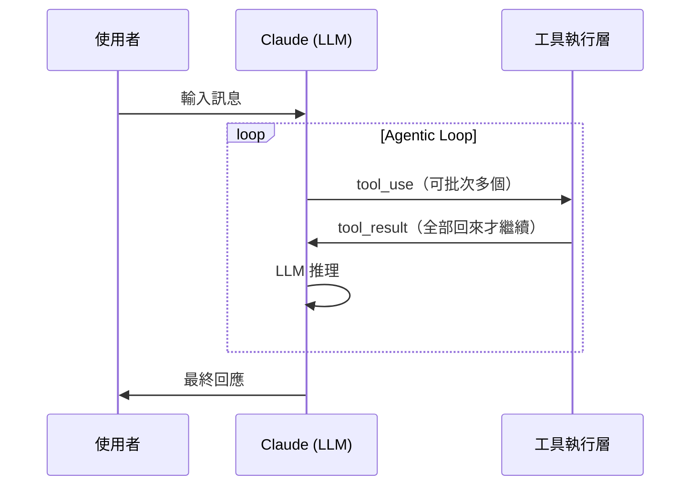
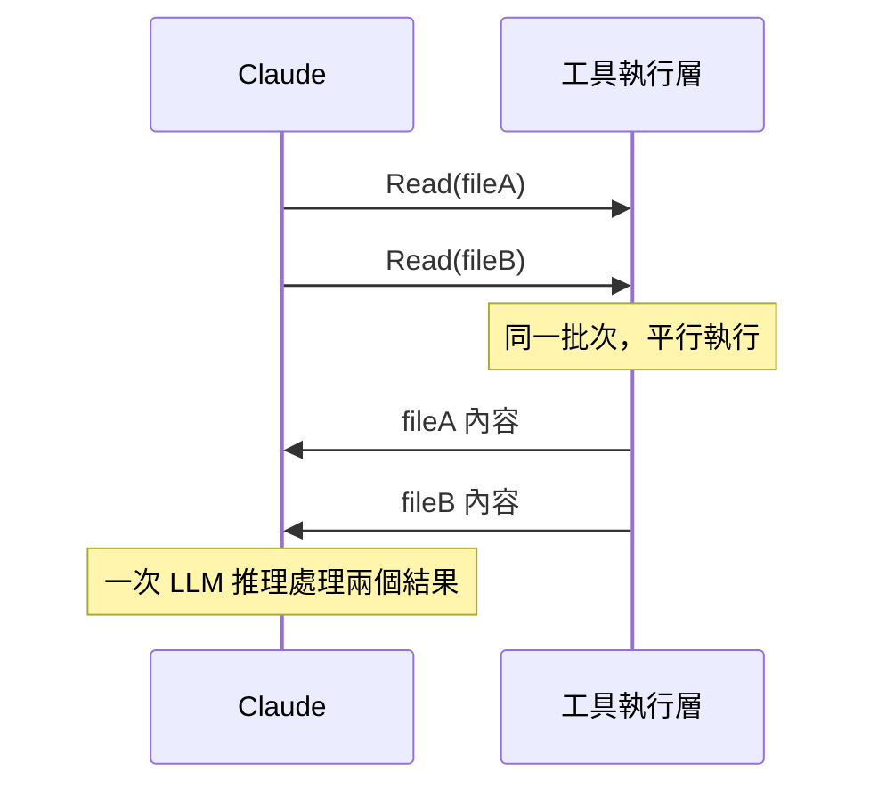
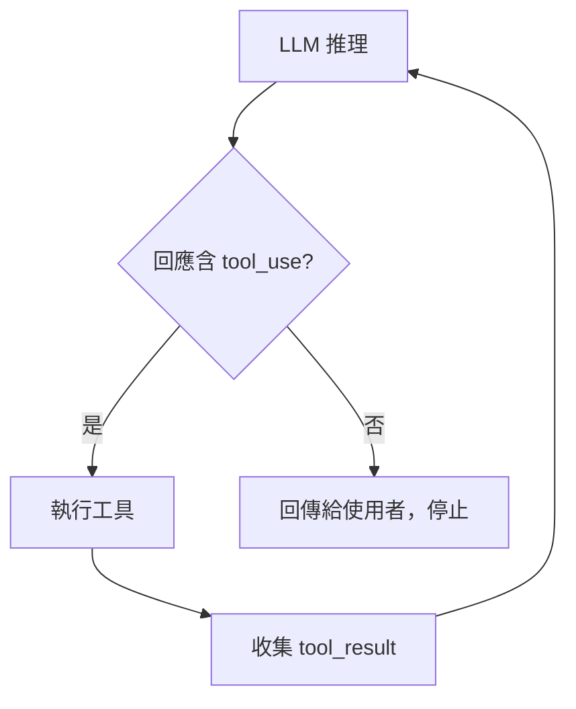

# Claude Code 工具系統

## Agentic Loop

Claude Code 的工具執行架構基於 Anthropic API 標準 agentic loop：



### 單次推理的回應結構

一次 LLM 推理可在同一個 `content` 陣列中同時包含 `text` 和 `tool_use`，順序固定：

```json
{
  "content": [
    { "type": "thinking", "signature": "..." },
    { "type": "text", "text": "說明文字..." },
    { "type": "tool_use", "name": "Edit", "input": {...} },
    { "type": "tool_use", "name": "Edit", "input": {...} }
  ]
}
```

所以並非「text **或** tool_use」，而是**一次推理可同時產生 text + 多個 tool_use**。

### 批次 tool call（一次推理可執行多個工具）



### Loop 終止條件

LLM 推理產生的回應**不含 `tool_use`** 時，loop 結束，控制權回到使用者：



### 例外情況

| 情況 | 說明 |
|------|------|
| **批次 tool call** | 多個 tool_use 同批發出 → 全部結果一起回來 → 一次推理 |
| **`disable-model-invocation: true`** | Skill 可設定跳過 LLM 推理，直接執行 |
| **背景 Bash（`run_in_background`）** | 不阻塞，inference 繼續；結果以 `<task-notification>` 非同步通知 |
| **Subagent** | 有自己獨立的 agentic loop，不佔主 agent 的推理次數 |

來源：`6370316b...jsonl`，各 TOOL_CALL 之間的時間間隔（2~3 秒）可觀察到 LLM 推理。

---

## 工具分類

工具分三類：

| 類型 | 說明 | 數量 |
|------|------|------|
| **Pre-loaded（系統預載）** | schema 已在 context，可直接呼叫 | 9 個 |
| **Deferred（延遲載入）** | schema 未載入，需先 ToolSearch；系統以 `<available-deferred-tools>` 標記 | 16 個 |
| **MCP** | 由外部 MCP server 提供（`mcp__{server}__{tool}`）；server 連線時預載，未連線時不存在 | 視設定 |

延遲載入的好處：節省 token（工具 schema 很長）；代價：多一次 ToolSearch round trip。

---

## 完整工具清單

**權限說明：**
- **自動允許**：預設直接執行，不詢問
- ⚠️ **預設詢問**：可透過 `permissions.allow` 設定關閉（詳見 [permissions.md](permissions.md)）

| 工具 | 類型 | 權限 | 作用 |
|------|------|------|------|
| **Read** | 預載 | 自動允許 | 讀取本地檔案內容 |
| **Glob** | 預載 | 自動允許 | 用 glob pattern 搜尋檔案路徑 |
| **Grep** | 預載 | 自動允許 | 用 regex 搜尋檔案內容（ripgrep） |
| **ToolSearch** | 預載 | 自動允許 | 載入 deferred 工具（見下方） |
| **TaskGet** | Deferred | 自動允許 | 取得任務詳情 |
| **TaskList** | Deferred | 自動允許 | 列出所有使用者任務 |
| **TaskOutput** | Deferred | 自動允許 | 讀取背景 Bash 任務輸出 |
| **CronList** | Deferred | 自動允許 | 列出所有排程 |
| **Edit** | 預載 | ⚠️ 可設定 | 對檔案進行精確字串替換；設定：`Edit` |
| **Write** | 預載 | ⚠️ 可設定 | 寫入/覆蓋整個檔案；設定：`Write` |
| **Bash** | 預載 | ⚠️ 可設定 | 執行 shell 命令；支援 `run_in_background`（完成後以 `<task-notification>` 通知）；設定：`Bash(command:*)` |
| **Agent** | 預載 | ⚠️ 可設定 | 啟動子 agent（見下方）；設定：`Agent` |
| **Skill** | 預載 | ⚠️ 可設定 | 執行 skill（見下方）；設定：`Skill(skill-name)` |
| **AskUserQuestion** | Deferred | ⚠️ 可設定 | 主動向使用者提問；設定：`AskUserQuestion` |
| **WebFetch** | Deferred | ⚠️ 可設定 | 抓取 URL 內容；設定：`WebFetch(domain:example.com)` |
| **WebSearch** | Deferred | ⚠️ 可設定 | 搜尋網路；設定：`WebSearch` |
| **NotebookEdit** | Deferred | ⚠️ 可設定 | 編輯 Jupyter notebook（`.ipynb` 必須用此工具，Edit 會報錯）；設定：`NotebookEdit` |
| **EnterPlanMode** | Deferred | ⚠️ 可設定 | 進入 Plan 模式；計畫存至 `~/.claude/plans/{slug}.md` |
| **ExitPlanMode** | Deferred | ⚠️ 可設定 | 離開 Plan 模式，提交計畫給使用者審核 |
| **EnterWorktree** | Deferred | ⚠️ 可設定 | 在 `.claude/worktrees/{name}` 建立 git worktree 隔離環境 |
| **TaskCreate** | Deferred | ⚠️ 可設定 | 建立任務（ID 為數字，如 `1`）；設定：`TaskCreate` |
| **TaskUpdate** | Deferred | ⚠️ 可設定 | 更新任務狀態；設定：`TaskUpdate` |
| **TaskStop** | Deferred | ⚠️ 可設定 | 停止**背景 Bash 任務**（ID 為 hash，如 `bz6rlnhqb`）；無法停止 TaskCreate 任務；設定：`TaskStop` |
| **CronCreate** | Deferred | ⚠️ 可設定 | 建立定時排程（session-only，Claude 退出後消失）；設定：`CronCreate` |
| **CronDelete** | Deferred | ⚠️ 可設定 | 刪除排程；設定：`CronDelete` |
| **mcp__ide__getDiagnostics** | MCP | ⚠️ 可設定 | 取得 IDE 診斷資訊（lint/type 錯誤）；設定：`mcp__ide__getDiagnostics` |
| **mcp__ide__executeCode** | MCP | ⚠️ 可設定 | 在 IDE 執行程式碼；設定：`mcp__ide__executeCode` |

來源：`b360f366...jsonl`（完整工具調用測試）

---

## ToolSearch

**元工具（工具的工具）**，唯一預設就存在的 deferred 工具載入器。

### 查詢模式

| 模式 | 範例 | 說明 |
|------|------|------|
| 直接選取 | `select:Glob` | 知道工具名稱時直接載入 |
| 多工具選取 | `select:Read,Edit,Grep` | 一次載入多個 |
| 關鍵字搜尋 | `"list directory"` | 不確定工具名稱時搜尋 |

### 工具載入流程

```
Claude 需要某工具
    ↓
ToolSearch("select:ToolName")   ← 將工具 schema 載入 context
    ↓
直接呼叫 ToolName(...)
```

### 有效範圍

- **同一 session**：載入一次後可直接呼叫，不需重複 ToolSearch
- **跨 session**：每次新對話都要重新載入，context 不跨 session 保留

### 效率影響

每次 ToolSearch = 多一次 tool call + 多一次 LLM 推理（約 2~3 秒）。預載工具省去此步驟。

---

## Skill 系統

### Skill 是什麼

放在 `.claude/skills/<name>/SKILL.md` 的 Markdown 指令檔，告訴 Claude 如何完成特定任務。

### 觸發方式

| 方式 | 觸發者 | 機制 |
|------|--------|------|
| `/skill-name` | 使用者輸入 | CLI 在框架層讀取 SKILL.md，展開為 `isMeta: true` 訊息注入 context；Claude 不需呼叫 Skill 工具 |
| `Skill` tool | Claude 主動 | Claude 先 ToolSearch 載入 Skill 工具，再呼叫執行 |

### 執行流程（以 `/session-analyze` 為例）

```
/session-analyze file.jsonl       ← 使用者輸入
    ↓
CLI 展開 SKILL.md 為 meta 訊息   ← 框架處理（不進 LLM）
    ↓
Claude 看到指令，決定要用 Bash
    ↓
Bash(python3 parse-session.py ...) ← 執行
```

### SKILL.md frontmatter

```yaml
---
name: skill-name
description: 何時觸發此 skill 的說明
argument-hint: <arg1> [arg2]
allowed-tools: Bash(python3 *), Read, Glob
disable-model-invocation: true   # 可選：停用 LLM 呼叫
context: fork                    # 可選
agent: Explore                   # 可選：指定執行的 agent 類型
---
```

### 動態內容注入（`!` 前綴）

SKILL.md 中可用 `!` 前綴在展開時執行命令並注入結果：

```markdown
- **PR Diff**: !`gh pr diff $ARGUMENTS[0]`
```

### 腳本預處理模式

對話內容可能很長，建議先用腳本壓縮再給 LLM 分析：

```markdown
!`python3 "${CLAUDE_SKILL_DIR}/scripts/parse.py" "$ARGUMENTS"`
```

---

## Agent 工具

### subagent_type 選項（共 5 種）

| subagent_type | 可用工具 | 說明 |
|---------------|----------|------|
| `general-purpose` | 全部（`*`） | 通用型，適合複雜多步驟任務 |
| `statusline-setup` | Read、Edit | 專門設定 Claude Code 狀態列 |
| `Explore` | 除 Agent、ExitPlanMode、Edit、Write、NotebookEdit | 快速探索 codebase；支援 quick / medium / very thorough 三種深度 |
| `Plan` | 除 Agent、ExitPlanMode、Edit、Write、NotebookEdit | 軟體架構規劃，回傳實作計畫 |
| `claude-code-guide` | Glob、Grep、Read、WebFetch、WebSearch | 回答 Claude Code / SDK / API 問題；支援 `resume` 繼續前次 agent |

### Subagent 特性

| 特性 | 說明 |
|------|------|
| **獨立 context** | 每個 subagent 有自己的 context window，不共享主 agent 對話歷史 |
| **工具隔離** | 每種 subagent_type 有各自的工具白名單 |
| **agentId** | 呼叫後回傳 agentId（如 `aabcf4bda0b27ca01`，`a` 前綴 = `local_agent`），可用 `resume` 參數繼續 |
| **結果回傳** | 完成後以 TOOL_RESULT 回傳（含 `totalDurationMs`、`totalTokens`、`totalToolUseCount`） |
| **不同 model** | Subagent 可能使用不同 model；實測 Explore 使用 `claude-haiku-4-5-20251001`，主 agent 為 `claude-sonnet-4-6` |
| **不產生獨立 JSONL** | Subagent 活動全部以 `agent_progress` progress 記錄在主 session JSONL |

來源：`00bbda8a...jsonl`（實測 Explore subagent）

### Agent 類型代號（來源：binary）

```js
{ local_bash:"b", local_agent:"a", remote_agent:"r", in_process_teammate:"t" }
```

### Console UI 呈現

`agent_progress` 在 console 以縮排樹狀即時呈現：

```
Explore(List files in project)
  ⎿  Prompt: 列出...
  ⎿  Bash(find /d/project/test_claude_skill ...)
  ⎿  Read(/d/project/test_claude_skill/CLAUDE.md)
  ⎿  Response: 完美。現在...
```

`⎿` 表示 subagent 子操作；主 LLM 只拿到最後的 Response 內容。

### agent_progress 記錄結構

```json
{
  "type": "progress",
  "data": {
    "type": "agent_progress",
    "agentId": "aabcf4bda0b27ca01",
    "message": {
      "type": "assistant",
      "message": { "model": "claude-haiku-4-5-20251001", "content": [...] }
    }
  },
  "toolUseID": "agent_msg_...",
  "parentToolUseID": "toolu_011re..."
}
```

### Agent toolUseResult 結構

```json
{
  "status": "completed",
  "agentId": "aabcf4bda0b27ca01",
  "content": [{ "type": "text", "text": "..." }],
  "totalDurationMs": 16247,
  "totalTokens": 23272,
  "totalToolUseCount": 5,
  "usage": { ... }
}
```

### Agent 間通訊協議（IPC message types）

| 訊息類型 | 說明 |
|---------|------|
| `task_assignment` | 主 → sub：派任務 |
| `idle_notification` | sub → 主：閒置（含 summary、completedTaskId） |
| `agent_progress` | sub → 主：執行進度 |
| `permission_request` | sub → 主：請求操作許可 |
| `permission_response` | 主 → sub：回覆許可 |
| `shutdown_request/approved/rejected` | 關閉協商 |
| `teammate_terminated` | teammate 結束通知 |
| `team_permission_update` | 團隊權限同步 |
| `mode_set_request` | 切換操作模式 |
| `plan_approval_request/response` | Plan 模式計畫審核 |

### Agent Memory 目錄

| 範圍 | 路徑 | 特性 |
|------|------|------|
| project | `.claude/agent-memory/` | 版控共享 |
| user | `~/.claude/agent-memory/` | 跨專案 |
| local | `.claude/agent-memory-local/` | 不進版控 |

### Teammate 生成模式

| `teammateMode` | 說明 |
|----------------|------|
| `tmux` | 用 tmux 開新視窗執行 |
| `in-process` | 同進程內執行 |
| `auto` | 自動選擇 |

---

## Hooks

Claude Code 支援在特定事件觸發時自動執行 shell 命令或 LLM prompt。

### 支援的事件（來源：binary `2.1.72`）

| 事件 | 說明 |
|------|------|
| `PreToolUse` | 工具呼叫前 |
| `PostToolUse` | 工具呼叫成功後 |
| `PostToolUseFailure` | 工具呼叫失敗後 |
| `UserPromptSubmit` | 使用者送出訊息時 |
| `Notification` | 收到通知時 |
| `SessionStart` / `SessionEnd` | session 開始/結束 |
| `Stop` | Claude 停止回應時 |
| `SubagentStart` / `SubagentStop` | subagent 啟動/停止 |
| `PreCompact` | context 壓縮前 |
| `PermissionRequest` | 權限確認請求時 |
| `Setup` | 初始化時 |
| `TeammateIdle` | teammate 閒置時 |
| `TaskCompleted` | 任務完成時 |
| `Elicitation` / `ElicitationResult` | 資訊蒐集事件 |
| `ConfigChange` | 設定變更時 |
| `WorktreeCreate` / `WorktreeRemove` | worktree 建立/移除 |
| `InstructionsLoaded` | 指令載入時 |

### Hook 類型（來源：binary schema）

**`command` 類型**（執行 shell 命令）

| 欄位 | 必填 | 說明 |
|------|------|------|
| `type` | ✓ | `"command"` |
| `command` | ✓ | 要執行的 shell 命令 |
| `timeout` | | 逾時秒數 |
| `statusMessage` | | spinner 顯示的自訂訊息 |
| `once` | | `true` 表示執行一次後自動移除 |
| `async` | | `true` 表示背景執行，不阻塞 |
| `asyncRewake` | | `true` 表示背景執行，但 exit code 2 時喚醒 model（blocking error），隱含 async |

**`prompt` 類型**（讓 LLM 評估）

| 欄位 | 必填 | 說明 |
|------|------|------|
| `type` | ✓ | `"prompt"` |
| `prompt` | ✓ | 提示文字（可用 `$ARGUMENTS` 取得 hook 輸入 JSON） |
| `timeout` | | 逾時秒數 |
| `model` | | 指定 model（如 `"claude-sonnet-4-6"`），預設用小型快速 model |
| `statusMessage` | | spinner 顯示的自訂訊息 |
| `once` | | `true` 表示執行一次後自動移除 |

### Hook 在 JSONL 中的記錄

Hook 執行結果以 `progress` 記錄注入 session JSONL：

```json
{
  "type": "progress",
  "data": {
    "type": "hook_progress",
    "hookName": "PostToolUse:Read"
  }
}
```

`hookName` 格式為 `{事件}:{工具名稱}`（如 `PostToolUse:Read`）。

來源：`6370316b...jsonl`；hook schema 來自 binary `2.1.72`
